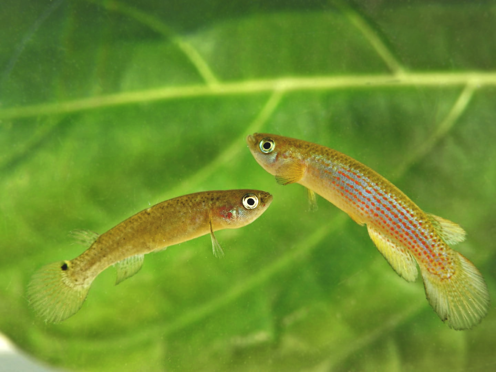
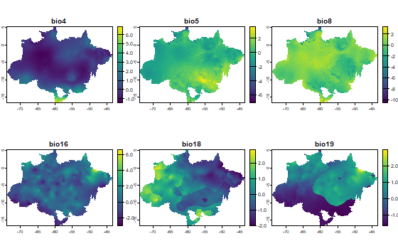

# **Projeto final para disciplina 'O nicho ecológico e a distribuição geográfica'**

Neste projeto são elaborados Modelos de Distribuição de Espécies (MDE) para peixes do gênero *Anablepsoides* (Cryprinodontiformes: Rivulidae) na Amazônia brasileira.

*Anablepsoides* são pequenos peixes rivulídeos não anuais, fortemente associados a florestas tropicais úmidas, com distribuição majoritária na Amazônia. Das aproximadamente 50 espécies válidas, apenas três não ocorrem nesse bioma. A grande maioria dessas espécies possui poucos dados de ocorrência disponíveis, sendo muitas delas recentemente descritas.

{width="359"}

Este grupo se distribui em pequenos córregos, alagados ou poças, podendo até sair da água e se deslocar entre diferentes corpos d'água, realizando saltos no ambiente terrestre, em busca de novas áreas para reprodução ou recursos alimentares. Por isso, é considerado um grupo de peixes anfíbios. Assim, as espécies de Anablepsoides não são encontradas exclusivamente próximas a grandes rios, habitando diversos tipos de corpos d'água disponíveis. Até o momento, não foi identificado um padrão claro de distribuição que defina a presença desses peixes dentro das florestas tropicais.

Dessa forma, este estudo tem como objetivo **avaliar a distribuição de *Anablepsoides* por meio de Modelos de Distribuição de Espécies (MDE) na Amazônia brasileira, buscando identificar a área de distribuição do gênero e os principais fatores bioclimáticos que a explicam.**

## **Hipóteses:**

**- H1:** Fatores bioclimáticos específicos limitam a distribuição das espécies do gênero Anablepsoides dentro da Amazônia, indicando que apenas determinadas áreas do bioma são adequadas para sua presença.

## **1.** Preparação de dados

### Pacotes utilizados para modelagem

```{r instalando e lendo pacotes}

# funcao para instalar pacotes se ainda não estao instalados
install_pack <- function(x){
  new.packages <- x[!(x %in% installed.packages()[,"Package"])]
  if(length(new.packages)) install.packages(new.packages)
}

pacotes <- c(
  "tidyverse", 
  "rnaturalearth", 
  "rnaturalearthdata", 
  "nngeo", 
  "sf", 
  "tmap", 
  "spocc", 
  "CoordinateCleaner", 
  "spThin", 
  "mapview", 
  "mapedit", 
  "raster", 
  "viridis", 
  "usdm", 
  "ENMTools", 
  "geodata",
  "ade4",
  "robis",
  "here",
  "sdmpredictors",
  "geobr",#Official Spatial Data Sets of Brazil
  "tools",
  "sp",
  "biomod2",
  "janitor",
  "tidyterra",
  "pROC"
  
)

install_pack(pacotes)

for(i in pacotes){
  eval(bquote(library(.(i))))
}

sf::sf_use_s2(use_s2 = FALSE)

select <- dplyr::select
```

### Organizando diretórios

```{r criar diretórios, warning = FALSE}
dir.create("dados")
dir.create("dados/ocorrencias")
dir.create("dados/variaveis")
dir.create("dados/shapefiles")
```

### **1.1** Area de estudo

- O dado de delimitação espacial foi obtido através do pacote *geobr*, que utiliza dados de biomas diretamente do IBGE pela função *read_biomes()*.

```{r obter dados espaciais}

biomas_br <- read_biomes()
amazonia <- subset(biomas_br, biomas_br$name_biome == "Amazônia")

#plot
tm_shape(amazonia) +
  tm_polygons()

```

### **1.2** Dados de ocorrências
- Pelas descrições de habitat do grupo de estudo e por ele ser amplamente distribuído no bioma. Foi escolhida a delimitação de todo bioma Amazônia dentro do Brasil. 

- Os dados de ocorrências utilizados neste projeto foram obtidos através de um longo processo de consulta em acervos científicos, periódicos, amostragens e também do GBIF. 
- *Esses dados fazem parte da pesquisa de doutorado e já estavam planilhados anteriormente.*

```{r leitura de ocorrencias, warning = FALSE}
occ_data <- read.csv("./dados/ocorrencias/occ_anablepsoides.csv", 
                               header = T, 
                               sep = ";", encoding = "UTF-8")

occ_data <- occ_data %>%
  rename(
    sp = Espécie,
    latitude = Latitude,
    longitude = Longitude,
    lote = Lote
  ) %>%
  mutate(longitude = as.numeric(longitude),
         latitude = as.numeric(latitude))
         
         
         # Remover NAs
occ_data <- occ_data %>%
  drop_na(longitude, latitude)

          occ_data_vector <- st_as_sf(occ_data, coords = c("longitude", "latitude"), crs = 4326)
          
          occ_data_vector <- occ_data %>%
            tidyr::drop_na(longitude, latitude) %>%
            dplyr::mutate(lon = longitude, lat = latitude) %>%
            sf::st_as_sf(coords = c("lon", "lat"), crs = 4326)
          
#visualizar
# map
tm_shape(amazonia) +
  tm_polygons() +
  tm_shape(occ_data_vector) +
  tm_dots(size = .2, shape = 21, col = "steelblue") +
  tm_graticules(lines = FALSE) +
  tm_view(bbox = c(xmin = -74, xmax = -34, ymin = -33, ymax = 5))

          
```

### **1.3** Filtragem

- A filtragem foi de grande importância, pois, como os dados foram compilados a partir de coleções científicas e amostragens de campo, frequentemente são catalogados inúmeros espécimes ou lotes de indivíduos para uma mesma localidade. O processo de remoção de dados duplicados foi essencial.

- A filtragem por distância espacial também resultou em uma redução significativa dos dados, sendo crucial para evitar o enviesamento dos modelos. Foi definida uma distância mínima de 50 km entre cada ocorrência.

#### Limite espacial

-*Aqui foram removidas as ocorrências de outros biomas (cerrado, amazônia e caatinga) e fora dos limites do brasil.*

```{r recortar apenas occs da area de estudo, warning = FALSE}
# crop to limit
st_crs(amazonia) <- 4326
occ_data_sptlim <- st_intersection(occ_data_vector, amazonia)
occ_data_sptlim

occ_data_sptlim <- occ_data_sptlim %>%
  dplyr::select(names(occ_data_vector))

#map
plot(st_geometry(amazonia), col = "lightgreen", border = "darkgreen") +
plot(st_geometry(occ_data_sptlim), col = "blue", add = TRUE)

```
-*Observa-se que muitas ocorrências são sobrepostas e agrupadas em determinados locais, logo, precisam ser triadas*

#### Viés

-*Aqui foram removidas as ocorrências duplicadas, com lat e long iguais e localizadas no mar.*

```{r removendo vies das occs, warning = FALSE}

# flag data
  
occ_data_sptlim_bias <- CoordinateCleaner::clean_coordinates(
  x = sf::st_drop_geometry(occ_data_sptlim),
  species = "sp",
  lon = "longitude",
  lat = "latitude",
  outliers_mtp = 2,
  value = "clean", 
  tests = c("duplicates", 
            "equal", 
            "seas", 
            "zeros"
  )) %>%
  tibble::as_tibble() %>%
  dplyr::mutate(lon = longitude, lat = latitude) %>%
  sf::st_as_sf(coords = c("lon", "lat"), crs = 4326)
occ_data_sptlim_bias

# filtro de distância espacial

occ_data_sptlim_bias <- occ_data_sptlim_bias

        occ_data_sptlim_bias <- occ_data_sptlim_bias %>%
        mutate(genero = "anablepsoides")

filter_thin <- spThin::thin(loc.data = occ_data_sptlim_bias,
                            lat.col = "latitude",
                            long.col = "longitude",
                            spec.col = "genero",
                            thin.par = 50,
                            reps = 1,
                            write.files = FALSE,
                            write.log.file = FALSE,
                            locs.thinned.list.return = TRUE,
                            verbose = TRUE) %>%
  .[[1]] %>%
  tibble::as_tibble() %>%
  dplyr::rename_with(tolower) %>%
  dplyr::mutate(sptdist_filter = TRUE)
filter_thin


# join
occ_data_sptlim_bias_sptdist <- dplyr::left_join(
  x = occ_data_sptlim_bias,
  y = filter_thin,
  by = c("longitude", "latitude")) %>%
  filter(sptdist_filter)
occ_data_sptlim_bias_sptdist

#Exportando os dados 

occ_data_filter <- occ_data_sptlim_bias_sptdist

# vetor
occ_data_filter %>%
  sf::st_write("dados/ocorrencias/occ_anablep_data_filter_edit.shp" , delete_layer = TRUE)

# tabela
occ_data_filter %>%
  sf::st_drop_geometry() %>%
  readr::write_csv("dados/ocorrencias/occ_anablep_data_filter_edit.csv")

# ------Organizando para rodar os modelos ------
# Seleccionar occ

occ_sf <- st_read("./dados/ocorrencias/occ_anablep_data_filter_edit.shp")

occ_data_ready <- as.data.frame(occ_sf) %>% 
  select(sptdst_,longitd,latitud)

# extrair coordenadas
coordinates(occ_data_ready) <- ~longitd + latitud

```
- Após a filtragem dos dados a distribuição das ocorrências é seguinte:
``` {r plotar mapa de occs, warning = FALSE}
# map
tm_shape(amazonia) +
  tm_polygons() +
  tm_shape(occ_data_sptlim_bias_sptdist) +
  tm_dots(size = .2, shape = 21, col = "steelblue")
  
```

### **1.3.1** Variaveis ambientais

-*Os Anablepsoides são conhecidos por serem associados também a microhabitas, pensando nesse sentido, a resolução das variáveis baixadas foi de 5 arcmin.*
- *Foram utilizadas variáveis bioclimáticas do World Clim e identificada a seguinte matrix de correlação:*


```{r obtendo dados bioclimaticos, warning = FALSE}

# download variables
env <- worldclim_global("bio", res = 5,
                        path = "dados/variaveis")

# rename
names(env)
names(env) <- paste0("bio",1:19)
names(env)
env

# plot
plot(env$bio1)

# adjust extent and resolution
env_amazon <- env %>%
  terra::crop(amazonia,mask = TRUE) #%>%
  terra::aggregate(env_amazon, fact = .5/res(env)[1])
env_amazon

# plot
tm_shape(env_amazon$bio1) +
  tm_raster(palette = "-RdBu", n = 10) +
  tm_shape(amazonia) +
  tm_borders(col = "black") +
  tm_layout(legend.position = c("right", "bottom"))

```


#### Colinearidade
- *A filtragem por colinearidade foi realizada a partir de uma matriz de correlação de Pearson e testes para verificar o Fator de Inflação da Variância*
- *Restaram seis variáveis: *
      1. BIO4 = Temperature Seasonality
      2. BIO5 = Max Temperature of Warmest Month
      3. BIO8 = Mean Temperature of Wettest Quarter
      4. BIO16 = Precipitation of Wettest Quarter
      5. BIO18 = Precipitation of Warmest Quarter
      6. BIO19 = Precipitation of Coldest Quarter

{width="359"}

```{r verificando e removendo dados ambientais correlacionados, warning = FALSE}

# correlation
ENMTools::raster.cor.matrix(
  env_amazon, method = "pearson")
ENMTools::raster.cor.plot(env_amazon)


# pca
env_amazon_pca <- ade4::dudi.pca(env_amazon, center = TRUE,
                             scale = TRUE, scannf = FALSE, 
                             nf = nlyr(env_amazon))
screeplot(env_amazon_pca, main = "Eigenvalues")

# vifstep

env_amazon_vifstep <- usdm::vifstep(env_amazon, th = 2)
env_amazon_vifstep

# vifcor
env_amazon_vifcor <- usdm::vifcor(env_amazon, th = .7)
env_amazon_vifcor

# select
env_amazon_vif <- usdm::exclude(env_amazon, env_amazon_vifstep)
env_amazon_vif

        env_amazon_cor <- usdm::exclude(env_amazon, env_amazon_vifcor)
        env_amazon_cor

env_amazon_vif_scale <- terra::scale(env_amazon_vif)
env_amazon_vif_scale

# plot
plot(env_amazon_vif, col = viridis::viridis(100))
plot(env_amazon_vif_scale, col = viridis::viridis(100))

#export
terra::writeRaster(x = env_amazon_vif_scale,
                   filename = paste0("dados/variaveis/", names(env_amazon_vif_scale), ".tif"),
                   overwrite = TRUE)

```


## **2.** Construção dos modelos
-*Aqui foram construidos os modelos através dos algoritmos 'GLM','GAM','ANN' e 'RF' com o pacote BIOMOD*

```{r configurando parametros do BIOMOD, warning = FALSE}

# Escolha os algoritmos a ser usados
mds_algo <- c('GLM','GAM',"ANN","RF")
# Número de repetições
n_rep <- 4 # Número de repetições que desejo (seleção aleatória de variáveis) 

# Porcentagem de dados para amostra
data_sample <- 70 

# Métrica de avaliação
eval_metric <- c("ROC","TSS")

# Opções globais BIOMOD_EnsembleModeling

# Limite de inclusão do modelo
model_thresh <- c(0.5,0.5) 

biomod_data <- BIOMOD_FormatingData(
  resp.var = occ_data_ready,
  expl.var = env_amazon_vif_scale,
  resp.name = "anablepsoides_amazonicos",
  filter.raster = TRUE,
  PA.nb.rep = 3, # NUmber of batch pseudo absent (at least 3)
  PA.strategy = 'random',
  dir.name = "C:/Users/Salu Coêlho/Documents/UFRN/LISE/Doutorado/Disciplinas/nicho_ecologico"
)


# Criar nosso modelo
biomod_model <- BIOMOD_Modeling(
  bm.format = biomod_data,
  models = mds_algo,
  CV.strategy = "random",     #crossvalidation
  CV.perc = 0.7,
  CV.nb.rep	= 2,
  metric.eval = c('TSS','ROC')
)

```

### **2.1** Curvas de resposta
```{r obter curva de resposta, warning = FALSE}
# Plot response curve

env_window <- bm_PlotResponseCurves(
  biomod_model,
  fixed.var = 'mean', 
  )

var_plot <-
    as.data.frame(env_window$tab) %>% 
    filter(pred.val < 0.99 & pred.val > 0.1 # so os melhores
    ) %>%
    group_by(expl.name,expl.val) %>% 
    summarise_at(vars(pred.val),
                 c(mean,sd),
                 na.rm = T) %>% 
    ggplot() +
    geom_ribbon(
      aes(
        x = expl.val,
        ymax = fn1+fn2,
        ymin = fn1-fn2
      ),
      fill = "grey"
    ) +
    geom_line(
      aes(
        x = expl.val,
        y = fn1
      ),
      color = "black"
    ) +
    theme_classic() +
    labs(x = "Valores variavel explicativa",
         y = "Valores preditos") +
    facet_wrap(~expl.name, scales = "free", ncol = 3) 

```

## **3.** Avaliações de modelo

```{r avaliar modelos, warning = FALSE}

# Avaliar o performance do modelo
biomod_model_evaluation <- get_evaluations(biomod_model)

# Mostrar resultados
print(biomod_model_evaluation)

## Plot de ROC and TSS

# Fazer figura TSS vs ROC
bm_PlotEvalMean(biomod_model) 


```

## **4.** Predições
```{r realizar predicoes, warning = FALSE}

# Identificar os modelos que tiveram melhor performance
well_peform_m <- biomod_model_evaluation %>% 
  filter(validation >= 0.7) %>% 
  pull(full.name)

# Previsões usando os modelos treinados
predictions_biomod <- BIOMOD_Projection(
  bm.mod = biomod_model,
  models.chosen = well_peform_m,
  new.env = env_amazon_vif_scale,  
  proj.name = "future_Prediction"
)

```

## **5. ** Ensembles dos modelos treinados
-*Predição final a partir do ensemble dos melhores modelos gerados*
- Essa predição nos indica que a distribuição dos *Anablepsoides* não seria uniforme ao longo do bioma amazônico, e sim associado algumas regiões, como nossa hipótese previa.  Inclusive em uma área que se sobrepõe principalmente sobre partes dos rios Amazonas e sua foz, Madeira e Negro. Essas indicações podem ser úteis para entender e levantar hipóteses sobre questões biogeograficas do grupo.

```{r ensembles, warning = FALSE}

model_ens <- BIOMOD_EnsembleModeling(
  bm.mod = biomod_model,
  models.chosen = well_peform_m,
  metric.select = "TSS",
  em.by = "all"
)

model_ens_proj <- BIOMOD_EnsembleForecasting(
  bm.em = model_ens,
  # bm.proj = biomod_model,
  new.env = env_amazon_vif_scale,
  proj.name = "ens_anablepsoides"
)

plot(model_ens_proj)

get_evaluations(model_ens)

env_window <- bm_PlotResponseCurves(
  model_ens,
  fixed.var = 'mean', 
  )

```
